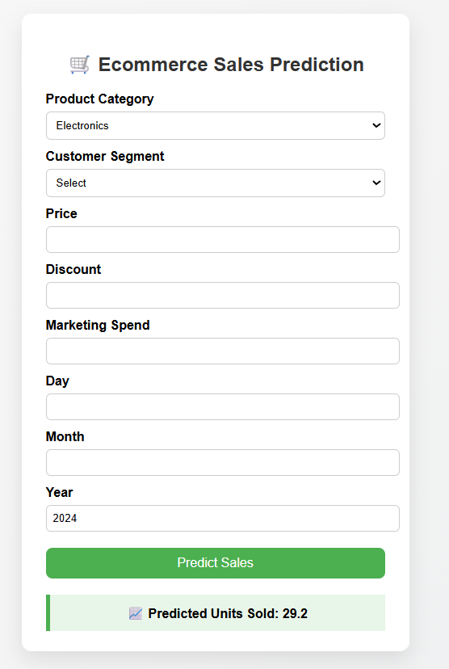

# 🛒 E-commerce Sales Predictor

A **Flask web application** that predicts e-commerce product sales using a **Linear Regression model** trained on historical sales data. Users can input product details, customer segment, price, discount, marketing spend, and date to get predicted units sold.

---

## 📊 Dataset

This project uses the **E-commerce Sales Prediction Dataset** from Kaggle:  
[E-commerce Sales Prediction Dataset](https://www.kaggle.com/datasets/nevildhinoja/e-commerce-sales-prediction-dataset)

**Columns include:**

- `Date` – Date of sale  
- `Product_Category` – Electronics, Clothing, Furniture  
- `Customer_Segment` – Consumer, Corporate, Home Office  
- `Price` – Product price  
- `Discount` – Discount applied  
- `Marketing_Spend` – Marketing spend for the product  
- `Units_Sold` – Target variable (units sold)  

---

## ⚙️ Features

- Predict **units sold** for any product based on input features.  
- Uses **Linear Regression** with preprocessing:  
  - One-hot encoding for categorical features  
  - Scaling for numeric features (`Price`, `Discount`, `Marketing_Spend`, `day`, `month`, `year`)  
- **Interactive Flask web app** with a clean HTML/CSS frontend.  
- Model trained locally and stored in **`sales_prediction_model.pkl`** for use in Flask app.  

---

## 🖥️ Example Output

### Web Form
  
*Users select product category, customer segment, enter price/discount/marketing spend and date.* 
*Predicted units sold displayed after submitting the form.*

---

## 🚀 How to Use

Follow these steps to run the E-commerce Sales Predictor locally:

1. **Clone the repository**
    ```bash
    git clone https://github.com/h-arshadd/flask-ecommerce-predictor.git
    cd flask-ecommerce-predictor
    ```

2. **Create and activate a virtual environment** (optional but recommended)
    ```bash
    python -m venv venv
    # Windows
    venv\Scripts\activate
    # Mac/Linux
    source venv/bin/activate
    ```

3. **Install required dependencies**
    ```bash
    pip install -r requirements.txt
    ```

4. **Run the Flask app**
    ```bash
    python app.py
    ```

5. **Open the app in your browser**
    ```
    http://127.0.0.1:5000/
    ```

6. **Use the application**
    - Fill in the product details:
        - Product category
        - Customer segment
        - Price
        - Discount
        - Marketing spend
        - Date (day, month, year)  
    - Click **Predict Sales** to see the predicted units sold.

